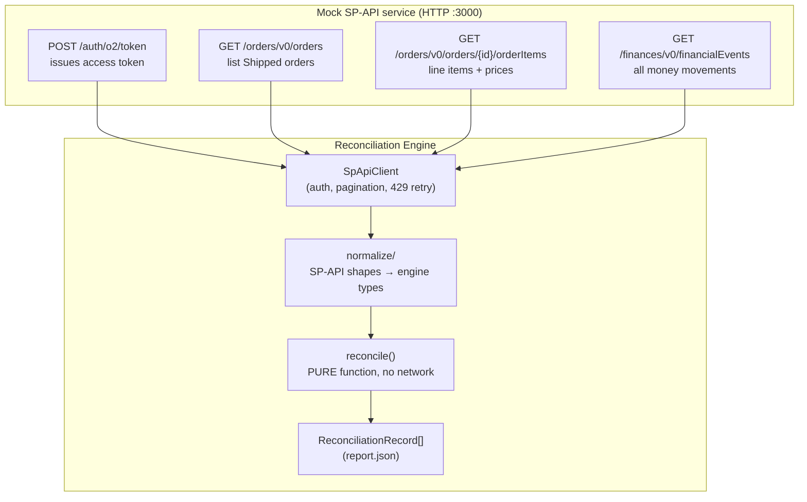
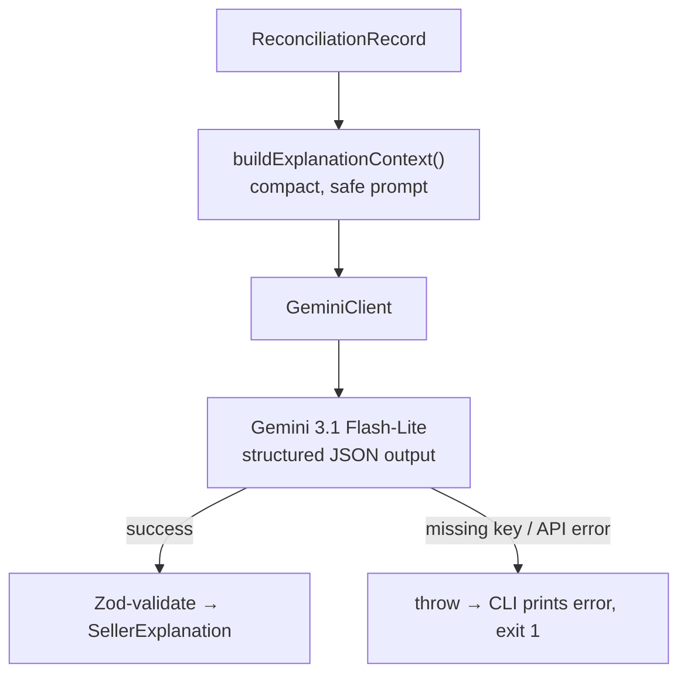
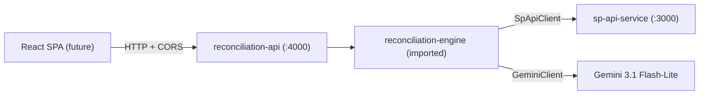

# Reconciliation Engine — Complete Flow Explained

A plain-English walkthrough of what this project does, how the pieces fit together, and what every term means. If you read only one document to understand the system, read this one.

---

## 1. The one-paragraph version

Amazon pays sellers *after* it takes out fees, processes refunds, handles chargebacks, and applies reimbursements. Because of this, the money that lands in a seller's account (**actual settled**) is rarely what they'd naively expect from the order (**expected revenue**). The **Reconciliation Engine** takes a seller's orders and their financial events, lines them up by order, computes what *should* have been paid vs. what *was* paid, and **flags the orders where the numbers don't add up** — so a human can chase the money that's missing.

This repo has **three independent pieces**:

| Piece | What it is | Directory |
|---|---|---|
| **Mock SP-API service** | A fake version of Amazon's Selling Partner API. Serves orders + financial events over HTTP, with auth, pagination, and rate limiting — just like the real thing. | `sp-api-service/` |
| **Reconciliation Engine** | The "brain." Pulls data from the mock (or real) API, normalizes it, and runs the reconciliation logic. Its core is a pure function with no network dependency. | `reconciliation-engine/` |
| **Reconciliation API** | The consumer-facing HTTP API. Wraps the engine and exposes orders, finances, the reconciliation report, and on-demand explanations for a browser SPA. | `reconciliation-api/` |

They are deliberately decoupled: the engine's core doesn't know or care whether data came from the mock or the real Amazon API, and the API layer adds no business logic — only transport.

On top of these sits an **optional LLM explanation layer** (Google Gemini) that turns each machine-readable reconciliation record into a plain-English explanation a seller can actually read. It never changes the math — it only narrates numbers the engine already produced. See [Section 9](#9-seller-explanations-llm-layer).

---

## 2. Glossary — every term you need

Read this once and the rest of the doc will click.

| Term | Meaning |
|---|---|
| **Order** | What the customer bought: one or more line items, each with a price, tax, shipping, and quantity. Comes from the **Orders API**. |
| **Line item** | A single SKU within an order. An order can have several (e.g. a bundle). |
| **Financial event** | Any money movement Amazon records against an order: the sale settlement, a fee, a refund, a chargeback, a reimbursement, etc. Comes from the **Finances API**. |
| **Principal** | The **product price portion** of a money movement — the item price itself, *excluding* tax, shipping, and fees. When Amazon settles a $49.98 sale, the `Principal` line is `+49.98`. When it refunds it, the `Principal` line is `-49.98`. This is the single most important line type for shortpay detection. |
| **Commission / referral fee** | Amazon's cut for selling on the platform. We assume a **flat 15%** of the item subtotal (real Amazon uses per-category rates — this is a documented simplification). |
| **Expected revenue** | What the seller *should* net for an order, computed from order data alone: `items + shipping + tax − commission`. |
| **Actual settled** | What the seller *actually* netted: the **sum of every financial event** tied to the order. Fees and refunds are negative, so they pull this number down. |
| **Discrepancy** | `actualSettled − expectedRevenue`. **Negative = underpaid.** This is the headline "how far off are we" number for the whole order. |
| **Shortpay** | A flag meaning the seller was underpaid on the **product principal** specifically — Amazon kept, refunded, or reversed principal it shouldn't have. |
| **Shortpay tolerance** | A small dollar threshold (default **$0.50**) below which we ignore a gap, so floating-point rounding or trivial differences don't get flagged as real problems. |
| **No settlement** | A flag meaning an order exists but has **zero** matching financial events — a payout that never happened. |
| **Reconcilable order** | An order we actually evaluate. Only `Shipped` orders qualify; `Pending` and `Cancelled` are skipped (nothing has settled yet, or the sale didn't happen). |

---

## 3. The big picture (data flow)



Everything left of `reconcile()` is about **fetching and reshaping** data. `reconcile()` itself is where the actual accounting logic lives, and it takes plain arrays in and gives plain records out — no HTTP involved. That's what makes it unit-testable without a server running.

---

## 4. The mock SP-API service — structure & how we consume it

The mock mirrors real Amazon SP-API response shapes (nested `payload`, `Orders` array, `NextToken`, etc.) so the client code would need minimal changes to point at the real API later.

### 4.1 Authentication (LWA — Login With Amazon, simplified)

Every data call needs a valid, non-expired access token.

```
POST /auth/o2/token
{ "grant_type": "client_credentials", "client_id": "...", "client_secret": "..." }
→ { "access_token": "...", "expires_in": 3600 }
```

The engine's client fetches this token once, caches it, and re-sends it as the `x-amz-access-token` header on every subsequent request. It refreshes 30 seconds before expiry.

> Source: `reconciliation-engine/src/client/sp-api-client.ts` → `ensureToken()`

### 4.2 The three data endpoints

| Endpoint | Purpose | Key fields the engine uses |
|---|---|---|
| `GET /orders/v0/orders` | List orders in a date range, filtered by status. | `AmazonOrderId`, `OrderStatus`, `MarketplaceId` |
| `GET /orders/v0/orders/{orderId}/orderItems` | Line items for one order. | `SellerSKU`, `QuantityOrdered`, `ItemPrice`, `ItemTax`, `ShippingPrice` |
| `GET /finances/v0/financialEvents` | Every financial event, grouped by category. | `AmazonOrderId`, event amounts, fee/charge types |

A typical order-items response looks like:

```json
{
  "payload": {
    "AmazonOrderId": "222-3456789-0123456",
    "OrderItems": [
      {
        "SellerSKU": "WIDGET-002",
        "QuantityOrdered": 2,
        "ItemPrice":    { "CurrencyCode": "USD", "Amount": "49.98" },
        "ItemTax":      { "CurrencyCode": "USD", "Amount": "4.00"  },
        "ShippingPrice":{ "CurrencyCode": "USD", "Amount": "0.00"  }
      }
    ]
  }
}
```

> **Important:** `ItemPrice.Amount` is the **line total** (already multiplied out by quantity), matching Amazon's Orders API semantics. The engine does **not** multiply by `QuantityOrdered` again.

Financial events are grouped into named lists — the ones the engine understands:

```json
{
  "payload": {
    "FinancialEvents": {
      "ShipmentEventList":   [ /* the sale: Principal, Tax, Commission, FBA fees... */ ],
      "RefundEventList":     [ /* money returned to a buyer */ ],
      "AdjustmentEventList": [ /* reimbursements, corrections */ ],
      "ServiceFeeEventList": [ /* account/service fees */ ],
      "ChargebackEventList": [ /* forced reversal via card dispute */ ],
      "GuaranteeClaimEventList": [ /* A-to-z guarantee claim payouts */ ]
    }
  }
}
```

### 4.3 Pagination

All three endpoints paginate with `NextToken`. The client loops until `NextToken` is absent, accumulating every page — see `fetchAllOrders`, `fetchOrderItemsForAll`, and `fetchAllFinancialEvents`. Financial-event pages are **merged by category** so all `ShipmentEventList` entries across pages end up in one array.

### 4.4 Rate limiting & retries

The mock returns **`429 Too Many Requests`** after a configurable threshold and includes a **`Retry-After`** header telling you exactly how long until a slot frees. The client honors it:

- On a `429`, it reads `Retry-After` (seconds) and waits that long, plus a little **jitter** (random 0–250 ms) so retries don't all fire at the same instant.
- If there's no header, it falls back to **capped exponential backoff** (`1s → 2s → 4s …`, capped at 12s).
- Up to **6 attempts** before giving up.

> Source: `computeBackoffMs()` and `request()` in `sp-api-client.ts`.

---

## 5. Normalization — turning Amazon's shapes into engine types

Amazon's responses are deeply nested and inconsistent (money is sometimes a string, sometimes a number; fields go missing). The `normalize/` layer flattens everything into two simple, predictable types before the engine ever sees it.

### 5.1 Orders → `ReconciliationOrder`

`normalize/orders.ts` converts each order into:

```ts
{
  orderId: string,
  orderStatus: string,
  marketplaceId: string,
  items: [{ sellerSKU, quantityOrdered, itemPrice, itemTax, shippingPrice }]
}
```

Missing numeric fields are treated as `0` and a **warning** is recorded (never a crash — that's requirement NF-3). Warnings are collected per-order so they can be attached to the final record.

### 5.2 Financial events → `ReconciliationFinanceLine[]`

`normalize/finances.ts` flattens every event category into a **flat list of finance lines**, one per money movement:

```ts
{
  eventId: string,        // synthetic unique id, used for de-duplication
  orderId?: string,       // may be absent (e.g. SKU-only adjustments)
  sellerSKU?: string,
  eventCategory: string,  // "ShipmentEventList", "RefundEventList", ...
  lineType: string,       // "Principal", "Commission", "Tax", "Chargeback", ...
  amount: number,         // positive = money in, negative = money out
  currency: string,
  postedDate: string
}
```

So a single sale becomes several lines: one `Principal +49.98`, one `Commission −7.50`, one `Tax +4.00`, and so on. A refund becomes the same lines with flipped signs.

**Synthetic `eventId`:** Amazon doesn't give every line a stable ID, so the normalizer builds one from `category:postedDate:key:lineType:index`. This lets `dedupeFinanceLines()` drop exact duplicates so the same event is never counted twice.

---

## 6. The reconciliation logic (the pure core)

This all lives in `reconciliation-engine/src/engine/reconcile.ts` and `src/rules/index.ts`. It runs entirely in memory.

### Step 1 — Filter to reconcilable orders

```ts
RECONCILABLE_STATUSES = new Set(['Shipped'])
```

`Pending` and `Cancelled` orders are skipped entirely — they never appear in the report.

### Step 2 — Join finance lines to each order

For each order we gather its finance lines using two matching strategies (`lib/join.ts`):

1. **By `orderId`** — the line's `orderId` equals the order's id. (Most lines.)
2. **By `sellerSKU`** — for lines that have *no* `orderId` (e.g. inventory adjustments), match on SKU instead.

Lines are then de-duplicated by `eventId`.

### Step 3 — Compute expected revenue

```
expectedRevenue = Σ(itemPrice) + Σ(shippingPrice) + Σ(itemTax) − (Σ itemPrice × commissionRate)
```

With the default 15% commission, a $49.98 single-item order with $4.00 tax and no shipping expects:

```
49.98 + 0.00 + 4.00 − (49.98 × 0.15) = 53.98 − 7.50 = 46.48
```

### Step 4 — Compute actual settled

```
actualSettled = Σ(amount of every joined finance line)
```

Every line, all categories, all signs, added up. Fees and refunds (negative) drag it down.

### Step 5 — Compute discrepancy

```
discrepancy = actualSettled − expectedRevenue     // negative = underpaid
```

### Step 6 — Run the rules & attach flags

An order can carry **multiple flags** at once. Each flag comes with a human-readable message.

---

## 7. The rules (Phase 1)

### Rule RL-8 — `no_settlement`

> **If an order has zero joined finance lines → flag `no_settlement` ("Never settled").**

Simple but valuable: it catches payouts that never arrived at all.

### Rule RL-7 — `shortpay` (principal-level)

This is the subtle one. It does **not** look at the whole order — it looks at **Principal only**:

```ts
expectedPrincipal = Σ(itemPrice)                         // what principal we should receive
actualPrincipal   = Σ(amount where lineType === 'Principal')  // what principal we actually got
principalGap      = actualPrincipal − expectedPrincipal

if (principalGap < −shortpayTolerance) → flag "shortpay"
```

**Why Principal-only and not the whole discrepancy?** Because `actualSettled` already legitimately includes commission and FBA fees, which are *supposed* to be deductions. If we flagged shortpay whenever `actualSettled < expectedRevenue`, every perfectly clean order with normal fees would look "underpaid." Focusing on Principal isolates the cases where Amazon actually kept, refunded, or reversed product money it shouldn't have — the real recoverable dollars.

> **A key nuance visible in the report:** the shortpay **message** reports the *principal gap*, while the `discrepancy` field reports the *whole-order* net. These two numbers legitimately differ, because they measure different things. For example, order `333` shows `discrepancy: −297.28` but the shortpay message says `Underpaid by $149.99` — the $149.99 is the principal that was refunded, while the extra loss comes from a *separate* Guarantee Claim event that isn't a principal shortpay. (See the discussion in `stories/0004-reconciliation-engine.md` for why we keep these distinct.)

### Phase 2 (stubbed, not yet wired)

| Flag | Intent |
|---|---|
| `unexplained_fee` | A deduction type that isn't accounted for in expected revenue. |
| `missing_reimbursement` | A lost/damaged item with no reimbursement event. |

These are exported as no-op stubs in `rules/index.ts` so the shape is ready when Phase 2 begins.

---

## 8. The output record

Every reconciled (Shipped) order produces one record:

```json
{
  "orderId": "444-5678901-2345678",
  "expectedRevenue": 101.97,
  "actualSettled": -9.00,
  "discrepancy": -110.97,
  "flags": ["shortpay"],
  "flagMessages": ["Underpaid by $90.00"],
  "financeLines": [ /* every joined line, kept for drill-down */ ],
  "warnings": [ /* any normalization warnings for this order */ ]
}
```

`financeLines` is retained in full (RL-6) so a UI or a human can drill into *why* an order was flagged, line by line.

---

## 9. Seller explanations (LLM layer)

The record above is precise but technical. Most sellers don't want to read `discrepancy: -110.97` — they want a sentence. The **explanation layer** takes a finished `ReconciliationRecord` and asks **Google Gemini 3.1 Flash-Lite** to narrate it in plain English.

### The golden rule: the LLM never does math

The engine is the single source of truth for every number. The LLM is handed the *already-computed* figures and is explicitly instructed **not to recalculate or invent amounts** — only to explain what's there. This keeps the output trustworthy: if someone checks the math in a demo, it always traces back to `reconcile()`, not the model.



### How it works

1. **Context builder** (`explain/context.ts`) trims the record down to only what's needed — `expectedRevenue`, `actualSettled`, `discrepancy`, `flags`, `flagMessages`, summarized finance lines, warnings — and pairs it with a system prompt that defines the terms (including the `discrepancy` vs. principal-level `shortpay` distinction) and forbids arithmetic. No credentials or env values are ever sent.
2. **Gemini client** (`explain/gemini-client.ts`) calls the `generateContent` REST endpoint requesting **structured JSON output** (a fixed response schema), then validates the reply with Zod.
3. **Orchestration** (`explain/explain.ts`) attaches the `orderId` and returns a `SellerExplanation`.

### Structured output shape

```json
{
  "orderId": "444-5678901-2345678",
  "headline": "Underpaid by $90.00 on product principal",
  "summary": "You expected about $101.97 for this order, but the settlement came to -$9.00...",
  "reason": "The shipment principal settled at $29.97 versus an expected $119.97.",
  "evidence": ["Principal $29.97", "Commission -$4.50"],
  "recommendedAction": "Open a case with Amazon citing the $90.00 principal shortfall.",
  "confidence": "high"
}
```

### No fallback — fail loudly

There is **no templated/mock fallback**. If `GEMINI_API_KEY` is missing, or the API call fails (network, quota, 4xx/5xx), or the response can't be parsed/validated, the tool prints a clear error and exits non-zero. A confidently-wrong explanation is worse than an honest error.

### Cost & model

| | |
|---|---|
| Model | `gemini-3.1-flash-lite` (configurable via `GEMINI_MODEL`) |
| Price | ~$0.25 / 1M input tokens, ~$1.50 / 1M output tokens |
| Why this one | Cheapest current Flash-Lite tier available to new API keys |

### Running it

```bash
cd reconciliation-engine
# GEMINI_API_KEY must be set in .env (kept separate from SP-API creds)
pnpm reconcile -- --output report.json    # produce the report first
pnpm explain                              # explain flagged orders in report.json
pnpm explain -- --order 444-5678901-2345678   # explain one order
pnpm explain -- --all --output explanations.json   # explain every order, write to file
```

By default only **flagged** orders are explained (that's what a seller cares about); `--all` includes clean orders too.

---

## 10. Serving it over HTTP (the API layer)

Everything above is a library + CLI. The `reconciliation-api` package (`reconciliation-api/`) wraps the engine in a small Hono HTTP server so a browser SPA can consume it. It adds no business logic — it fetches via the engine's `SpApiClient`, normalizes, reconciles, and serves JSON.



### Endpoints

| Method | Path | Returns |
|---|---|---|
| `GET` | `/health` | liveness |
| `GET` | `/api/orders` | normalized orders + warnings |
| `GET` | `/api/finances` | normalized finance lines |
| `GET` | `/api/reconcile` | the `ReconciliationRecord[]` report (`?refresh=true` bypasses cache) |
| `POST` | `/api/explain/:orderId` | a `SellerExplanation` for one order |

### Two design choices worth knowing

- **Reconcile and explain are separate endpoints.** `/api/reconcile` is fast and deterministic, so the SPA's table renders immediately. The slow, paid Gemini call only happens when a seller clicks to explain a specific order. Failures stay loud: `404` for an unknown order, `502` if Gemini fails, `503` if no `GEMINI_API_KEY` is configured — never a fabricated explanation.
- **A short-TTL cache** (`DATA_CACHE_TTL_MS`, default 30s) holds the fetched + normalized + reconciled dataset in memory, so the four endpoints don't each re-hit the rate-limited mock, and so `explain` has a record to narrate. Concurrent requests during a refresh are de-duplicated into a single upstream fetch.

---

## 11. Worked examples (from the real seed data)

### A clean order — no flag
Product $46.48 expected, Amazon settles Principal + normal commission/FBA fees so `actualSettled ≈ expectedRevenue`. `discrepancy` is within tolerance, no Principal gap → **no flags**.

### `no_settlement`
An order returned by the Orders API whose `orderId`/SKUs match **nothing** in the finance data. Zero joined lines → **`no_settlement`, "Never settled."**

### `shortpay` via full refund — order `333`
- Sale: Principal `+149.99`. Then a full **refund**: Principal `−149.99`. So `actualPrincipal = 0`, `expectedPrincipal = 149.99` → gap `−149.99` → **`shortpay`, "Underpaid by $149.99."**
- Separately, a **Guarantee Claim** of `−149.99` also hit the order. That's why the whole-order `discrepancy` is `−297.28`, larger than the principal gap. The flag correctly attributes only the principal portion to shortpay.

### `shortpay` on a multi-item order — order `555`
- Two items: expected principal `199.99 + 15.00 = 214.99`.
- The finance data has one shipment Principal `+199.99`, fully reversed by a refund Principal `−199.99` (and the second SKU never got its own Principal line), so `actualPrincipal = 0`.
- Gap `−214.99` → **"Underpaid by $214.99"**, even though the whole-order `discrepancy` is only `−156.02` (a $45 inventory reimbursement and tax reversals partly offset the net). Different numbers, both correct — principal gap vs. net.

---

## 12. Edge cases & assumptions (know these before a demo)

- **Flat 15% commission** — not category-specific. Documented simplification.
- **Principal-level shortpay** — deliberately narrower than the whole discrepancy, to avoid false positives from legitimate fees. Fee/chargeback-driven losses (e.g. orders `666`, `888`) show a negative `discrepancy` but are **not** shortpay, because their loss isn't in the Principal lines. Those are Phase-2 territory (`unexplained_fee`).
- **`ItemPrice` is a line total** — already quantity-extended; not multiplied by `QuantityOrdered` again.
- **Only `Shipped` orders reconciled** — `Pending`/`Cancelled` are excluded by status, not by guessing from missing price fields.
- **SKU-based join fallback** — adjustments without an `orderId` are matched by `sellerSKU`.
- **Account-level fees excluded** — service/reserve events with no `orderId` and no SKU aren't attributed to any single order.
- **Missing numeric fields → `0` + warning** — never a crash (NF-3).
- **De-dup by `eventId`** — duplicate finance events are never double-counted.
- **Split shipments & multi-currency** — out of scope (Phase 2 / future).

---

## 13. How to run it end-to-end

```bash
# Terminal 1 — start the mock Amazon API
cd sp-api-service
pnpm dev                     # serves on http://localhost:3000

# Terminal 2 — run reconciliation against it
cd reconciliation-engine
cp .env.example .env         # reuses the same mock credentials
pnpm reconcile               # prints the report to stdout
pnpm reconcile -- --output report.json   # or write it to a file

# Optional — narrate flagged orders in plain English (needs GEMINI_API_KEY)
pnpm explain                 # explains flagged orders from report.json
```

Or serve it over HTTP for a frontend (with the mock still running in Terminal 1):

```bash
# Terminal 2 — the product API
cd reconciliation-api
cp .env.example .env         # set matching SP-API creds (+ GEMINI_API_KEY for explanations)
pnpm dev                     # serves on http://localhost:4000 (builds the engine first)

curl localhost:4000/api/reconcile
curl -X POST localhost:4000/api/explain/444-5678901-2345678
```

Run just the pure logic (no server needed):

```bash
cd reconciliation-engine
pnpm test                    # unit tests exercise reconcile() and the explain layer
```

### Configuration knobs (`.env`)

| Variable | Default | What it does |
|---|---|---|
| `SP_API_BASE_URL` | `http://localhost:3000` | Where the mock (or real) API lives |
| `SP_API_CLIENT_ID` / `SP_API_CLIENT_SECRET` | mock creds | LWA credentials (`CLIENT_ID`/`CLIENT_SECRET` also accepted) |
| `COMMISSION_RATE` | `0.15` | Flat referral-fee assumption |
| `SHORTPAY_TOLERANCE` | `0.50` | Minimum principal gap (in $) before flagging shortpay |
| `CREATED_AFTER` | `2020-01-01T00:00:00Z` | Order fetch start date |
| `GEMINI_API_KEY` | *(none)* | Google Gemini key for the explanation layer. Kept separate from SP-API creds; only needed for `pnpm explain` |
| `GEMINI_MODEL` | `gemini-3.1-flash-lite` | Which Gemini model the explanation layer uses |

The `reconciliation-api` package has its own `.env` (see `reconciliation-api/.env.example`) with the same knobs plus `PORT`, `CORS_ORIGIN`, and `DATA_CACHE_TTL_MS`.

---

## 14. Where things live (quick map)

| Concern | File |
|---|---|
| Fetch + auth + pagination + retry | `reconciliation-engine/src/client/sp-api-client.ts` |
| Orders → engine type | `reconciliation-engine/src/normalize/orders.ts` |
| Finance events → flat lines | `reconciliation-engine/src/normalize/finances.ts` |
| Join lines to orders / de-dupe | `reconciliation-engine/src/lib/join.ts` |
| Money parsing / rounding / formatting | `reconciliation-engine/src/lib/money.ts` |
| Core accounting (the pure function) | `reconciliation-engine/src/engine/reconcile.ts` |
| The rules (shortpay, no_settlement, stubs) | `reconciliation-engine/src/rules/index.ts` |
| Types & defaults (15%, $0.50, statuses) | `reconciliation-engine/src/domain/types.ts` |
| CLI entry point (`pnpm reconcile`) | `reconciliation-engine/src/cli/run.ts` |
| Config / env loading | `reconciliation-engine/src/lib/env.ts` |
| LLM prompt/context builder | `reconciliation-engine/src/explain/context.ts` |
| Gemini client (structured output) | `reconciliation-engine/src/explain/gemini-client.ts` |
| Explanation orchestration + types | `reconciliation-engine/src/explain/explain.ts`, `explain/types.ts` |
| Explanation CLI (`pnpm explain`) | `reconciliation-engine/src/cli/explain.ts` |
| HTTP API app + routes | `reconciliation-api/src/app.ts`, `reconciliation-api/src/routes/*.ts` |
| Cached fetch+normalize+reconcile | `reconciliation-api/src/lib/data-source.ts` |
| API server entry | `reconciliation-api/src/index.ts` |
| Product API reference | `reconciliation-api/API.md` |
| Mock API endpoint reference | `sp-api-service/API.md` |
| Reconciliation design & rule rationale | `stories/0004-reconciliation-engine.md` |
| LLM explanation design | `stories/0005-llm-seller-explanations.md` |
| Reconciliation API design | `stories/0006-reconciliation-api.md` |
