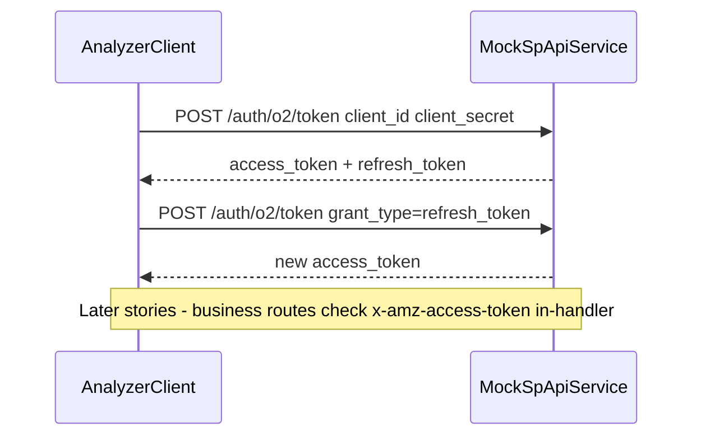

# 0001 — Simple Mock Auth (Access + Refresh Tokens)

**Status:** Done  
**Service:** `sp-api-service`  
**Overview:** Keep authentication minimal. Issue access + refresh tokens from a single token endpoint shaped like Amazon LWA. Defer authorization checks into business routes (orders, finances) when those are built — do not build a heavy auth/authorization subsystem now.

---

## Design principle

| Layer | What we do now | What we defer |
|-------|----------------|---------------|
| **Authentication** | Simple: prove client credentials, issue/refresh tokens | Full OAuth redirect, authorization codes, Seller Central UI |
| **Authorization** | Nothing fancy — no inspect endpoint, no global auth middleware | Token checks + seller/context rules **inside** orders/finances business handlers |

Auth exists only so the analyzer can practice “get token → call API with token.” Real permission and seller-scoping logic lives with the business endpoints later.

---

## Todo

- [x] Extend `src/lib/env.ts` with `CLIENT_ID`, `CLIENT_SECRET`, `MOCK_REFRESH_TOKEN`, `ACCESS_TOKEN_TTL_SECONDS`
- [x] Update `.env.example` with fake credentials and a short usage note
- [x] Create `src/auth/tokens.ts` — small in-memory helpers: issue access token, validate refresh token, check access token expiry
- [x] Create `src/routes/auth.ts` — only `POST /auth/o2/token`
- [x] Mount auth route in `src/app.ts`
- [x] Verify: client credentials → access + refresh tokens
- [x] Verify: refresh_token grant → new access token
- [x] Verify: bad credentials → error
- [x] Run `pnpm build` and `pnpm lint`

---

## No real Amazon seller ID or credentials required

This mock never talks to Amazon. Use fake env values only:

| Env var | Example fake value | Purpose |
|---------|-------------------|---------|
| `CLIENT_ID` | `amzn1.application-oa2-client.mockspapi` | Fake app client id |
| `CLIENT_SECRET` | `mock_client_secret` | Fake app secret |
| `MOCK_REFRESH_TOKEN` | `Atzr\|mock_refresh_token` | Seeded long-lived refresh token (no OAuth code exchange) |
| `ACCESS_TOKEN_TTL_SECONDS` | `3600` | Access token lifetime |

---

## Simplified flow



---

## Endpoint contract

### `POST /auth/o2/token`

Amazon-shaped path and response. Accept `application/x-www-form-urlencoded` or JSON.

**Issue tokens (simple bootstrap — no authorization code):**

```text
grant_type=client_credentials   (or omit / use a simple default)
client_id=...
client_secret=...
```

Returns:

```json
{
  "access_token": "Atza|...",
  "refresh_token": "Atzr|mock_refresh_token",
  "token_type": "bearer",
  "expires_in": 3600
}
```

**Refresh access token:**

```text
grant_type=refresh_token
refresh_token=Atzr|mock_refresh_token
client_id=...
client_secret=...
```

Returns a new `access_token` (and the same `refresh_token`).

**Errors (keep minimal):**

```json
{
  "error": "invalid_client",
  "error_description": "Client authentication failed"
}
```

or

```json
{
  "error": "invalid_grant",
  "error_description": "Refresh token is invalid"
}
```

---

## Files to add / change

| Path | Role |
|------|------|
| `src/lib/env.ts` | Auth-related env vars |
| `src/auth/tokens.ts` | Tiny token issue/validate helpers (no separate store service layer) |
| `src/routes/auth.ts` | `POST /auth/o2/token` only |
| `src/app.ts` | Mount `/auth` |
| `.env.example` | Document fake credentials |

**Explicitly not in this story:**

- `authorization_code` grant / `MOCK_AUTH_CODE`
- `GET /auth/tokens/inspect`
- Global `require-access-token` middleware
- Seller ID / multi-tenant authorization
- Persistence beyond process memory

Those belong in later business-logic stories (orders, finances), where handlers can call a small shared `assertAccessToken(c)` helper if needed.

---

## Implementation details

- Validate `client_id` / `client_secret` against env.
- Seed refresh token from `MOCK_REFRESH_TOKEN` so the client can refresh without a prior OAuth dance.
- Access tokens: opaque `Atza|...` strings with expiry tracked in a small in-memory map.
- Keep code in one small `tokens.ts` module — avoid over-structuring auth.
- Export a tiny `getAccessToken(token: string)` (or similar) for **future** business routes to call inline; do not wire it globally yet.

---

## Verification

1. `pnpm dev`
2. `POST /auth/o2/token` with valid client credentials → access + refresh
3. `POST /auth/o2/token` with `grant_type=refresh_token` → new access token
4. Bad `client_secret` → `invalid_client`
5. Bad refresh token → `invalid_grant`
6. `pnpm build` and `pnpm lint` pass
