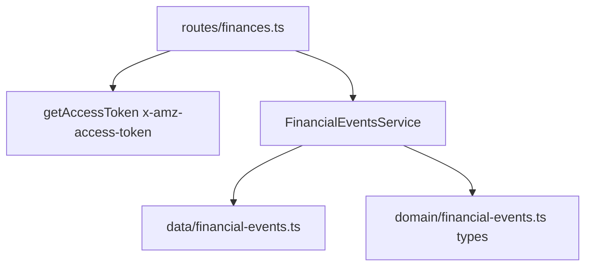

# 0002 — Mock Financial Events API

**Status:** Done  
**Service:** `sp-api-service`  
**Overview:** Implement Amazon SP-API-compatible `GET /finances/v0/financialEvents` with inline access-token checks, seeded realistic financial events, date filtering, NextToken pagination, and Amazon-style responses/errors.

---

## Todo

- [x] Create `src/domain/financial-events.ts` — Zod/TS models for FinancialEvents
- [x] Create `src/data/financial-events.ts` — seeded mock events (~25–35)
- [x] Create `src/services/financial-events.ts` — filter, paginate, re-bucket
- [x] Create `src/routes/finances.ts` — HTTP validation + response formatting
- [x] Mount finances routes in `src/app.ts`
- [x] Verify: no token → 403
- [x] Verify: with token → 200 Amazon-shaped payload
- [x] Verify: PostedAfter / PostedBefore filtering
- [x] Verify: MaxResultsPerPage + NextToken pagination
- [x] Verify: invalid params / bad NextToken → 400
- [x] Run `pnpm build` and `pnpm lint`

---

## Scope

Implement **only** `GET /finances/v0/financialEvents`, matching [Amazon listFinancialEvents](https://developer-docs.amazon.com/sp-api/reference/listfinancialevents).

Deferred: order-scoped endpoint, 429/500 simulation, MarketplaceId filter.

---

## Amazon contract

| Item | Behavior |
|------|----------|
| Path | `GET /finances/v0/financialEvents` |
| Auth header | `x-amz-access-token` (inline check via `getAccessToken()`) |
| Query | `PostedAfter`, `PostedBefore`, `MaxResultsPerPage` (1–100, default 100), `NextToken` |
| Success | `{ "payload": { "FinancialEvents": { ... }, "NextToken": "..." } }` |
| Errors | `{ "errors": [{ "code", "message", "details?" }] }` — `403` bad token, `400` invalid params |

Date rules: ISO 8601; `PostedBefore` requires `PostedAfter`; range > 180 days → empty; invalid params → `400 InvalidInput`.

---

## Layered design

| Layer | Path | Responsibility |
|-------|------|----------------|
| Domain | `src/domain/financial-events.ts` | Types for Currency, events, FinancialEvents envelope |
| Data | `src/data/financial-events.ts` | Seeded mock events |
| Service | `src/services/financial-events.ts` | Filter, paginate, build payload |
| Route | `src/routes/finances.ts` | Query validation, auth, HTTP response |

---

## Seed data

Mix of event types for analyzer testing:

- ShipmentEventList — Principal, Tax, Commission, FBA fees
- RefundEventList — partial/full refunds
- AdjustmentEventList — reimbursements / unexplained adjustments
- ServiceFeeEventList — stand-alone fees
- ChargebackEventList / GuaranteeClaimEventList — dispute-like events

Dates span last 30–60 days using relative `daysAgo()` helpers.

---

## Pagination

Flatten events by `PostedDate`, page with `MaxResultsPerPage`. `NextToken` is base64url JSON `{ o, pa, pb, m }`. Re-bucket page slice into type lists for Amazon-shaped response.

---

## Verification

1. Obtain token via `POST /auth/o2/token`
2. `GET /finances/v0/financialEvents` without token → `403`
3. With token → `200` with seeded lists
4. Date filters narrow results
5. `MaxResultsPerPage=2` + `NextToken` pagination works
6. Invalid params → `400`
7. `pnpm build` and `pnpm lint` pass
