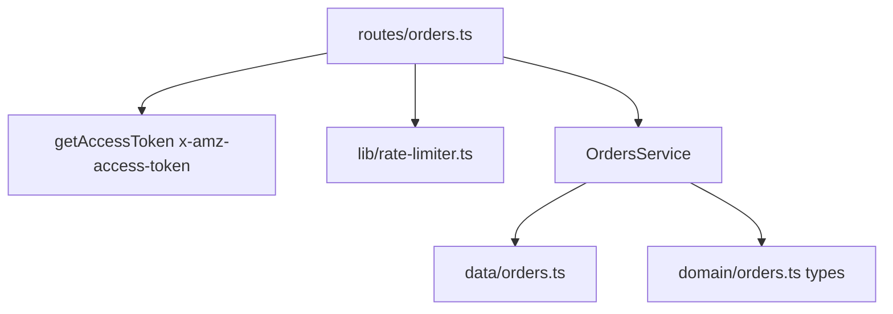

# 0003 — Mock Orders API

**Status:** Done
**Service:** `sp-api-service`
**Overview:** Implement Amazon SP-API v0-compatible Orders endpoints (`GET /orders/v0/orders`, `GET /orders/v0/orders/{orderId}/orderItems`) so the reconciliation engine can compute expected revenue per order and compare it against the Finances mock. Deliberately engineered seed data drives meaningful reconciliation results downstream.

---

## Business Requirement (source BRD)

### Purpose

Provide order-level data (what was sold, at what price, in what quantity) so the reconciliation engine can compute **expected revenue per order** — the baseline that actual settlement amounts (from the Finances mock) get compared against.

### Functional Requirements

| ID | Requirement |
|---|---|
| OR-1 | List orders within a date range, mimicking `GET /orders/v0/orders` |
| OR-2 | Get order items for a given order ID, mimicking `GET /orders/v0/orders/{orderId}/orderItems` |
| OR-3 | Support pagination via `NextToken`, even on small mock datasets |
| OR-4 | Each order carries `AmazonOrderId`, `PurchaseDate`, `OrderStatus`, `MarketplaceId` |
| OR-5 | Each order item includes `SellerSKU`, `QuantityOrdered`, `ItemPrice` (amount + currency), `ItemTax`, `ShippingPrice` |
| OR-6 | Support filtering by `OrderStatuses` (`Shipped`, `Cancelled`, `Pending`, ...) — functional, not cosmetic |
| OR-7 | `MarketplaceId` present on each order |

### Data Requirements (seed data)

- Mix of order statuses to test filtering
- A few `AmazonOrderId`s that **also appear in the mock Finances dataset** with a mismatched amount (demonstrates discrepancy detection)
- A few orders with **no corresponding Finances record at all** (simulates a payout that never settled)
- Multiple items on at least one order (order → items relationship)

### Non-Functional Requirements

| ID | Requirement |
|---|---|
| NF-1 | Response shape mirrors real SP-API Orders structure (nested `payload`, `Orders` array, etc.) |
| NF-2 | Return `429` after a configurable request threshold, to force retry/backoff handling |
| NF-3 | Require a valid (non-expired) mock access token on every call |

### Out of scope

- Real order fulfillment/shipment tracking data
- Buyer/PII data (real SP-API restricts this behind a Restricted Data Token — acknowledged, not simulated; see README)
- Multi-currency conversion (single currency, USD)
- `getOrder` (single order retrieval) — only list + order items per BRD scope

---

## Real Amazon contract referenced

Amazon's legacy Orders API v0 (what this project's README already names: `GET /orders/v0/orders`, `GET /orders/v0/orders/:orderId`). Confirmed field names from the v0 reference:

**`Order`:** `AmazonOrderId`, `PurchaseDate`, `LastUpdateDate`, `OrderStatus`, `FulfillmentChannel`, `OrderTotal` (`Money`), `NumberOfItemsShipped`, `NumberOfItemsUnshipped`, `MarketplaceId`.

**`OrderItem`:** `ASIN`, `SellerSKU`, `OrderItemId`, `Title`, `QuantityOrdered`, `QuantityShipped`, `ItemPrice` (`Money`), `ShippingPrice` (`Money`), `ItemTax` (`Money`).

**`Money`:** `{ CurrencyCode: string, Amount: string }` — note `Amount` is a **string** in the real Orders API (differs from the Finances mock's `CurrencyAmount: number`). Match this for authenticity.

**Query params for `getOrders`:** `CreatedAfter`, `CreatedBefore`, `LastUpdatedAfter`, `OrderStatuses` (array), `MarketplaceIds` (array), `MaxResultsPerPage`, `NextToken`.

**`getOrderItems`:** path `orderId`, query `NextToken`. Real API omits pricing fields for `Pending` orders — replicate this quirk.

**Errors:** `400` invalid params, `403` unauthorized, `404` order not found, `429` throttled, `500`/`503` — same shape as Finances mock: `{ "errors": [{ "code", "message", "details?" }] }`.

---

## Layered design



| Layer | Path | Responsibility |
|-------|------|-----------------|
| Domain | `src/domain/orders.ts` | Types for `Money`, `OrderItem`, `Order`, `GetOrdersResponse`, `GetOrderItemsResponse` |
| Data | `src/data/orders.ts` | Seeded orders + items, deliberately engineered |
| Service | `src/services/orders.ts` | Filter by date/status, paginate, look up order items |
| Route | `src/routes/orders.ts` | Query/path validation, auth, rate limit, HTTP response |
| Lib | `src/lib/rate-limiter.ts` | Reusable sliding-window request counter for `429` simulation |

---

## Seed data plan (engineered per BRD)

| AmazonOrderId | Status | Notes |
|---|---|---|
| `111-2345678-9012345` | Shipped | Matches Finances shipment exactly (clean baseline) |
| `222-3456789-0123456` | Shipped | Matches Finances shipment exactly (clean baseline) |
| `333-4567890-1234567` | Shipped | Matches Finances shipment exactly (clean baseline; later refunded downstream — not an Orders-level mismatch) |
| `444-5678901-2345678` | Shipped | **Mismatched**: Orders `ItemPrice` = 119.97 (3 × 39.99) vs Finances settled `Principal` = 29.97 — expected revenue far exceeds what was paid out |
| `555-6789012-3456789` | Shipped | **Multi-item order**: two distinct SKUs to exercise order → items relationship |
| `666-7890123-4567890` | Shipped | Matches Finances shipment exactly (clean baseline) |
| `777-8901234-5678901` | Shipped | **Mismatched**: Orders `ItemPrice` = 99.99 vs Finances settled `Principal` = 79.99 — shortpay scenario |
| `888-9012345-6789012` | Shipped | Matches Finances shipment exactly (clean baseline) |
| `999-0123456-7890123` | Shipped | Matches Finances shipment exactly (clean baseline) |
| `200-1111111-1111111` | Shipped | **No Finances record** — payout never settled |
| `201-2222222-2222222` | Shipped | **No Finances record** — payout never settled |
| `300-3333333-3333333` | Cancelled | Excluded from reconciliation; tests `OrderStatuses` filter |
| `301-4444444-4444444` | Pending | Excluded from reconciliation; `getOrderItems` omits pricing fields (Amazon quirk) |

`MarketplaceId` uses the real public Amazon US marketplace identifier `ATVPDKIKX0DER` (not PII — documented constant) for all orders. Dates use the same `daysAgo()`-style relative helper as the Finances mock so both datasets stay aligned over time.

---

## Endpoint contract

### `GET /orders/v0/orders`

Query: `CreatedAfter` (required), `CreatedBefore`, `OrderStatuses` (comma-separated), `MarketplaceIds` (comma-separated), `MaxResultsPerPage` (1–100, default 100), `NextToken`.

Success `200`:

```json
{
  "payload": {
    "Orders": [ { "AmazonOrderId": "...", "PurchaseDate": "...", "OrderStatus": "Shipped", "MarketplaceId": "ATVPDKIKX0DER", "...": "..." } ],
    "NextToken": "..."
  }
}
```

### `GET /orders/v0/orders/{orderId}/orderItems`

Path: `orderId`. Query: `NextToken`.

Success `200`:

```json
{
  "payload": {
    "AmazonOrderId": "111-2345678-9012345",
    "OrderItems": [ { "ASIN": "...", "SellerSKU": "...", "OrderItemId": "...", "QuantityOrdered": 1, "ItemPrice": { "CurrencyCode": "USD", "Amount": "89.99" }, "...": "..." } ],
    "NextToken": "..."
  }
}
```

`404` with `{ "errors": [{ "code": "NotFound", "message": "..." }] }` when `orderId` does not exist.

### Rate limiting (NF-2)

Sliding-window counter shared by both endpoints. Configurable via env: `ORDERS_RATE_LIMIT_THRESHOLD` (default 5 requests), `ORDERS_RATE_LIMIT_WINDOW_MS` (default 10000ms). Exceeding it returns `429`:

```json
{ "errors": [{ "code": "TooManyRequests", "message": "Rate limit exceeded" }] }
```

### Auth (NF-3)

Same pattern as Finances mock — inline `getAccessToken()` check on `x-amz-access-token`, no global middleware (per story 0001 design principle).

---

## Todo

- [x] Add `ORDERS_RATE_LIMIT_THRESHOLD`, `ORDERS_RATE_LIMIT_WINDOW_MS` to `src/lib/env.ts` and `.env.example`
- [x] Create `src/domain/orders.ts` — Money/Order/OrderItem/response types
- [x] Create `src/data/orders.ts` — 13 engineered seed orders + items
- [x] Create `src/lib/rate-limiter.ts` — reusable sliding-window limiter
- [x] Create `src/services/orders.ts` — filter, paginate, order-items lookup, Pending-order pricing omission
- [x] Create `src/routes/orders.ts` — mount `GET /v0/orders`, `GET /v0/orders/:orderId/orderItems`
- [x] Mount orders routes in `src/app.ts`
- [x] Add RDT/PII out-of-scope note to root `README.md`
- [x] Verify: no token → 403
- [x] Verify: list orders with `OrderStatuses` filter (13 total, 11 Shipped)
- [x] Verify: pagination via `NextToken` (page1/page2 distinct, tokens round-trip)
- [x] Verify: order items for existing/nonexistent order (200/404)
- [x] Verify: multi-item order (555) returns 2 distinct items
- [x] Verify: Pending order omits pricing fields, Cancelled order keeps them
- [x] Verify: mismatched orders (444, 777) return expected `ItemPrice` for downstream reconciliation
- [x] Verify: missing required query param (`CreatedAfter`) → 400
- [x] Verify: exceeding rate limit → 429 (confirmed with threshold=3: requests 1-3 pass, 4-5 throttled)
- [x] Run `pnpm build` and `pnpm lint` — both pass

## Verification notes

All checks run against the compiled service (`pnpm build` + `node dist/index.js`) using real `.env` credentials via `POST /auth/o2/token`, exactly as a real client would. The default `.env.example` rate-limit threshold (5 requests / 10s) is intentionally low for demo purposes — bump `ORDERS_RATE_LIMIT_THRESHOLD` in `.env` for heavier local testing against the Orders endpoints.
