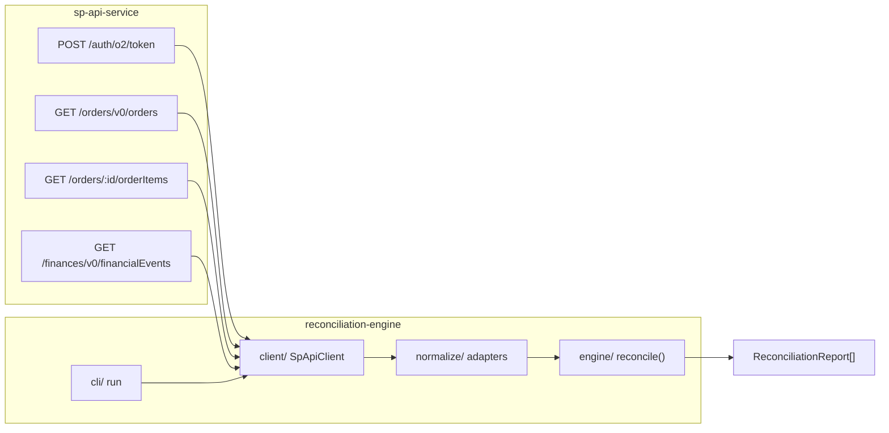

# 0004 — Reconciliation Engine

**Status:** Done
**Service:** `reconciliation-engine`
**Overview:** Build a pure, unit-testable reconciliation core that compares expected order revenue against actual settled amounts from financial events, flags discrepancies, and consumes the mock `sp-api-service` via a thin HTTP client/CLI. Phase 1 implements RL-1 through RL-8 with principal-level shortpay detection.

---

## Business Requirement (source BRD)

### Purpose

Given a seller's orders and their corresponding financial settlement events, determine whether each order was paid correctly, and if not, categorize why. This is the core product logic — intentionally decoupled from the API layer so it works unchanged whether fed by the mock service or real SP-API later.

### Functional Requirements

| ID | Requirement |
|---|---|
| RL-1 | For each order, identify all financial events associated with its `orderId` (primary) or `sellerSKU` (secondary for adjustments) |
| RL-2 | Exclude `Canceled` and `Pending` orders from reconciliation; only `Shipped` orders evaluated |
| RL-3 | Compute expected revenue: `Σ(itemPrice) + shippingPrice + itemTax − expectedCommissionFee` |
| RL-4 | `expectedCommissionFee` = flat 15% of item subtotal (documented simplification) |
| RL-5 | Sum all joined financial event amounts → `actualSettled` |
| RL-6 | Retain itemized finance lines per order for drill-down |
| RL-7 | Flag `shortpay` when principal gap exceeds tolerance (principal-level comparison) |
| RL-8 | Flag `no_settlement` when order has zero finance records |
| RL-9 | Flag `unexplained_fee` *(phase 2)* |
| RL-10 | Flag `missing_reimbursement` *(phase 2)* |
| RL-11 | Build RL-7 and RL-8 first |
| RL-12 | Configurable shortpay tolerance (default $0.50) |
| RL-13 | Output reconciliation record per evaluated order |
| RL-14 | `discrepancy = actualSettled - expectedRevenue` |
| RL-15 | Multiple flags per order allowed |

### Non-Functional Requirements

| ID | Requirement |
|---|---|
| NF-1 | Pure function: `(orders[], financeEvents[]) → reconciliationReport[]` — no API dependency in core |
| NF-2 | Independently unit-testable without network |
| NF-3 | Missing numeric fields → `0` + warning, never throw |

### Out of scope (this module)

- Report generation / Reports API
- Dashboard/UI rendering
- Real SP-API commission fee lookup
- Multi-currency conversion
- RL-9 and RL-10 (phase 2 stubs only)

---

## Architecture



| Layer | Path | Responsibility |
|-------|------|----------------|
| Domain | `src/domain/` | Engine-native types decoupled from SP-API |
| Normalize | `src/normalize/` | SP-API responses → engine inputs |
| Engine | `src/engine/reconcile.ts` | Pure reconcile orchestration |
| Rules | `src/rules/` | `shortpay`, `no_settlement` detectors |
| Client | `src/client/sp-api-client.ts` | Token, pagination, 429 retry |
| CLI | `src/cli/run.ts` | End-to-end runner |

---

## Key design decisions

### ItemPrice semantics

Amazon Orders API defines `ItemPrice` as the **line total** (unit price × quantity). The engine uses `ItemPrice` directly — not `ItemPrice × quantityOrdered`.

### Principal-level shortpay (RL-7)

Full `expectedRevenue` / `actualSettled` / `discrepancy` are always computed and output. Shortpay **detection** compares Principal only:

```
expectedPrincipal = itemSubtotal
actualPrincipal   = Σ financeLine.amount where lineType === 'Principal'
flag shortpay when: (actualPrincipal - expectedPrincipal) < -tolerance
```

This avoids false positives from FBA fees on otherwise-clean orders (e.g. order 111).

### Finance line join (RL-1)

1. **Primary:** `financeLine.orderId === order.orderId`
2. **Secondary:** lines without `orderId` matched by `sellerSKU` against order items (e.g. `MiscAdjustment -$22` on `GADGET-BASIC-002` → order 222)
3. **Excluded:** account-level events with no `orderId` and no matching SKU (subscription, reserve)

### Synthetic eventId for dedup

```
{category}:{postedDate}:{orderId|sku}:{lineType}:{index}
```

---

## Output schema (RL-13)

```json
{
  "orderId": "444-5678901-2345678",
  "expectedRevenue": 101.97,
  "actualSettled": -9.00,
  "discrepancy": -110.97,
  "flags": ["shortpay"],
  "flagMessages": ["Underpaid by $90.00"],
  "financeLines": [ "...itemized..." ],
  "warnings": []
}
```

---

## Expected results on mock seed data

| Order ID | Expected flag | Reason |
|---|---|---|
| `444-5678901-2345678` | `shortpay` | Principal $29.97 vs expected $119.97 |
| `777-8901234-5678901` | `shortpay` | Principal $79.99 vs expected $99.99 |
| `200-1111111-1111111` | `no_settlement` | No finance records |
| `201-2222222-2222222` | `no_settlement` | No finance records |
| `111...`, `222...`, etc. | none | Clean or within tolerance |
| `300...`, `301...` | absent | Filtered out (Canceled/Pending) |

---

## Todo

- [x] Scaffold `reconciliation-engine/` package + pnpm workspace + vitest
- [x] Define engine-native domain types and config
- [x] Build Orders + Finances normalizers
- [x] Implement pure `reconcile()` orchestration
- [x] Implement `shortpay` + `no_settlement` rules; stub RL-9/RL-10
- [x] Add fixtures + ≥3 unit tests per rule (16 tests total)
- [x] Build `SpApiClient` with auth, pagination, 429 retry
- [x] Add CLI entry point (`pnpm reconcile`)
- [x] Update root README + `reconciliation-engine/README.md`
- [x] End-to-end smoke test script (`scripts/verify-e2e.ts`)

## Verification notes

Unit tests: `cd reconciliation-engine && pnpm test` — 16 passing, no network.

End-to-end (requires running `sp-api-service`):

```bash
# Use matching credentials — copy sp-api-service/.env or set CLIENT_ID/CLIENT_SECRET
cd reconciliation-engine
pnpm exec tsx scripts/verify-e2e.ts
```

Expected: 11 shipped orders reconciled; `444`/`777` → `shortpay`; `200`/`201` → `no_settlement`; `300`/`301` absent.
