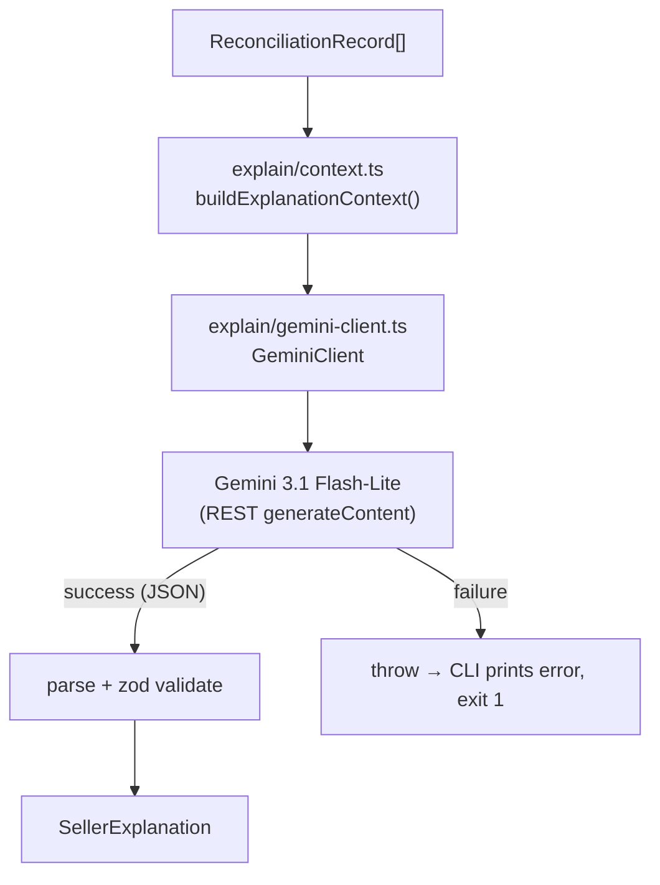

# 0005 — LLM Seller Explanations

**Status:** Done
**Service:** `reconciliation-engine`
**Overview:** Add an LLM explanation layer on top of the deterministic reconciliation engine so a seller can read, in plain English, why an order was flagged and how much money appears to be missing. The reconciliation math stays deterministic and unchanged; the LLM only *narrates* numbers the engine already produced. Uses Google Gemini 3.1 Flash-Lite.

---

## Purpose

The engine outputs precise but technical records (`expectedRevenue`, `actualSettled`, `discrepancy`, `flags`, `financeLines`). Sellers are not accountants — they want a sentence like *"Amazon refunded the full $149.99 on this order, so you were paid $0 of the product principal you expected."* This story turns each `ReconciliationRecord` into a seller-facing explanation via an LLM.

---

## Functional Requirements

| ID | Requirement |
|---|---|
| LE-1 | Convert a single `ReconciliationRecord` into a seller-readable explanation |
| LE-2 | Explanation is structured: `headline`, `summary`, `reason`, `evidence[]`, `recommendedAction`, `confidence` |
| LE-3 | The LLM must only explain numbers already in the record — never recalculate or invent amounts |
| LE-4 | The prompt must distinguish whole-order `discrepancy` from principal-level `shortpay` so explanations stay accurate |
| LE-5 | Expose a CLI (`pnpm explain`) that reads a reconciliation report and prints explanations |
| LE-6 | By default explain only flagged orders; `--all` includes clean orders; `--order <id>` explains one |
| LE-7 | Use Gemini 3.1 Flash-Lite (`gemini-3.1-flash-lite`), model name configurable via env |

## Non-Functional Requirements

| ID | Requirement |
|---|---|
| NF-1 | Reconciliation core (`reconcile()`) stays pure and untouched; the LLM layer is additive |
| NF-2 | **No fallback** — if the API key is missing or the Gemini call fails (network/quota/4xx/5xx), surface a clear error and exit non-zero. No templated/mock explanations |
| NF-3 | Gemini API key kept separate from SP-API credentials (`GEMINI_API_KEY`), required only for the explain command |
| NF-4 | Context building and response parsing are unit-testable without hitting the network (client is injectable) |

### Out of scope

- Dashboard/UI rendering of explanations
- Streaming responses
- Multi-language output
- Persisting explanations / caching

---

## Architecture



| Layer | Path | Responsibility |
|-------|------|----------------|
| Types | `src/explain/types.ts` | `SellerExplanation` schema + `ExplanationProvider` interface |
| Context | `src/explain/context.ts` | Record → compact, safe model input + prompt |
| Client | `src/explain/gemini-client.ts` | Gemini REST call, structured-output parsing, error propagation |
| Orchestration | `src/explain/explain.ts` | `explainRecord()` / `explainReport()` |
| CLI | `src/cli/explain.ts` | `pnpm explain` runner |
| Config | `src/lib/env.ts` | `GEMINI_API_KEY`, `GEMINI_MODEL` |

---

## Key design decisions

- **Deterministic-first:** the LLM receives finished numbers and a strict instruction not to do arithmetic. This keeps the demo trustworthy — if anyone checks the math it comes from `reconcile()`, not the model.
- **Structured output:** request `responseMimeType: application/json` with a `responseSchema` so the model returns a parseable object, validated by Zod before use.
- **No fallback by design:** a wrong-but-confident explanation is worse than an error. Missing key or API failure fails loudly.
- **Injectable provider:** `explainRecord(record, provider)` depends on an `ExplanationProvider` interface, so tests use a stub and the CLI uses the real Gemini client.

---

## Output schema (LE-2)

```json
{
  "orderId": "444-5678901-2345678",
  "headline": "Underpaid by $90.00 on product principal",
  "summary": "You expected $101.97 for this order but only $-9.00 settled...",
  "reason": "The shipment principal was $29.97 against an expected $119.97...",
  "evidence": ["Principal $29.97 vs expected $119.97", "Commission -$4.50"],
  "recommendedAction": "Open a case citing the $90.00 principal shortfall.",
  "confidence": "high"
}
```

---

## Todo

- [x] Add `GEMINI_API_KEY` / `GEMINI_MODEL` to env schema + `.env.example`
- [x] Define `SellerExplanation` schema + `ExplanationProvider` interface
- [x] Build context/prompt builder from a `ReconciliationRecord`
- [x] Implement `GeminiClient` (REST, structured output, error propagation)
- [x] Add `explainRecord()` / `explainReport()` orchestration
- [x] Add `pnpm explain` CLI (`--input`, `--order`, `--all`, `--output`)
- [x] Unit tests: context building, response parsing, error propagation (9 tests)
- [x] Update `docs/RECONCILIATION-FLOW.md` and READMEs

## Verification notes

Unit tests (no network): `cd reconciliation-engine && pnpm test`.

End-to-end (requires `GEMINI_API_KEY` and a report file):

```bash
cd reconciliation-engine
pnpm reconcile -- --output report.json   # produce a report (needs sp-api-service)
pnpm explain -- --input report.json      # narrate flagged orders via Gemini
```
