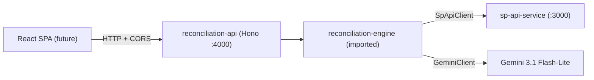

# 0006 — Reconciliation API

**Status:** Done
**Service:** `reconciliation-api` (new package)
**Overview:** Expose the reconciliation engine over HTTP so a browser SPA can consume it. A new standalone Hono package imports `reconciliation-engine` and serves four things: normalized **orders**, normalized **finances**, the deterministic **reconciliation report**, and **on-demand Gemini explanations** (a separate, per-order endpoint). API-only story — the React/Vite/shadcn SPA is a follow-up.

---

## Purpose

The engine today is a pure library + CLI. To build a UI we need an HTTP surface. Rather than bolt routes onto the mock `sp-api-service` (which simulates Amazon) or the pure engine, we add a dedicated **product API** package that orchestrates the engine. This keeps three concerns cleanly separated:

- `sp-api-service` — pretends to be Amazon.
- `reconciliation-engine` — pure reconciliation + explanation logic.
- `reconciliation-api` — consumer-facing HTTP API for our own frontend.

---

## Functional Requirements

| ID | Requirement |
|---|---|
| AP-1 | `GET /health` returns liveness |
| AP-2 | `GET /api/orders` returns normalized `ReconciliationOrder[]` (+ any warnings) |
| AP-3 | `GET /api/finances` returns normalized `ReconciliationFinanceLine[]` |
| AP-4 | `GET /api/reconcile` fetches -> normalizes -> runs `reconcile()`, returns `ReconciliationRecord[]` |
| AP-5 | `POST /api/explain/:orderId` returns a `SellerExplanation` for one order via Gemini |
| AP-6 | Reconcile and explain are **separate** endpoints so the table renders instantly and LLM cost is paid only on demand |
| AP-7 | CORS enabled for the SPA dev origin (configurable) |

## Non-Functional Requirements

| ID | Requirement |
|---|---|
| NF-1 | The engine stays a pure imported library; the API adds no business logic, only orchestration/transport |
| NF-2 | **No LLM fallback** — Gemini failure returns `502`; missing `GEMINI_API_KEY` returns `503` with a clear message |
| NF-3 | A short-TTL in-memory cache of the fetched+normalized dataset avoids re-hitting the rate-limited mock on every endpoint and gives `explain` a record source |
| NF-4 | Config is zod-validated; Gemini key kept separate from SP-API credentials |
| NF-5 | Route wiring is unit-testable with a stubbed data source / explanation provider (no live network) |

### Out of scope

- The React SPA itself (next story)
- Auth on the product API
- Persistence/DB, streaming responses, batch "explain all"

---

## Architecture



| Layer | Path | Responsibility |
|-------|------|----------------|
| Server | `src/index.ts`, `src/app.ts` | Hono app: logger, CORS, error handler, routes |
| Config | `src/lib/env.ts` | zod-validated env (PORT, SP-API creds, engine config, Gemini, CORS) |
| Data source | `src/lib/data-source.ts` | fetch + normalize + reconcile, cached with a short TTL |
| Routes | `src/routes/*.ts` | health, orders, finances, reconcile, explain |

---

## Endpoint contracts

| Method | Path | Response |
|---|---|---|
| GET | `/health` | `{ status, uptime }` |
| GET | `/api/orders` | `{ orders: ReconciliationOrder[], warnings: Record<string,string[]> }` |
| GET | `/api/finances` | `{ financeLines: ReconciliationFinanceLine[] }` |
| GET | `/api/reconcile` | `ReconciliationRecord[]` |
| POST | `/api/explain/:orderId` | `SellerExplanation` (or `404` unknown order, `502` Gemini error, `503` no key) |

---

## Key design decisions

- **New package, imports the engine.** Requires exposing `SpApiClient` (+ its config/return types) from the engine's public API; everything else needed (`reconcile`, `normalizeOrders`, `normalizeFinancialEvents`, `explainRecord`, `GeminiClient`, types) is already exported.
- **Shared cached data source.** One function fetches from the mock via `SpApiClient`, normalizes, and reconciles; the result is memoized with a short TTL. `explain` reads the cached record for the order (re-reconciles if cold).
- **Fail loud on LLM.** Mirrors story 0005: no templated fallback. `502` on Gemini failure, `503` if the key is missing.

---

## Todo

- [x] Export `SpApiClient` + types from `reconciliation-engine/src/index.ts`; add package `exports`/`main`/`types`
- [x] Scaffold `reconciliation-api` package + add to `pnpm-workspace.yaml`
- [x] `src/lib/env.ts` — zod config
- [x] `src/lib/data-source.ts` — fetch+normalize+reconcile with TTL cache
- [x] `src/app.ts` + `src/index.ts` — Hono app with CORS + error handler
- [x] Routes: health, orders, finances, reconcile, explain/:orderId
- [x] Unit tests: data-source cache + explain route (stubbed provider) — 12 tests
- [x] Update `docs/RECONCILIATION-FLOW.md` + package README + `reconciliation-api/API.md`

## Verification results

Build + lint clean; 12 unit tests pass (6 data-source cache, 6 route). Live smoke test against a running `sp-api-service`: `/api/reconcile` returned 11 records with 8 flagged (222/333/444/555/777/999 shortpay, 200/201 no_settlement), `/api/orders` 11 orders, `/api/finances` 71 lines, `/api/explain/:id` returned 404 (unknown), 503 (no key), and CORS header present for the SPA origin.

## Verification notes

```bash
# Terminal 1 — mock Amazon API
cd sp-api-service && pnpm dev            # :3000

# Terminal 2 — product API (needs engine built once)
pnpm --filter reconciliation-engine build
cd reconciliation-api && cp .env.example .env && pnpm dev   # :4000

curl localhost:4000/api/reconcile
curl -X POST localhost:4000/api/explain/444-5678901-2345678
```

Unit tests (no network): `cd reconciliation-api && pnpm test`.
