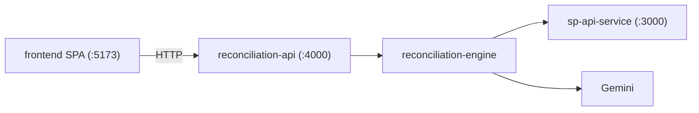

# 0007 — Frontend Dashboard

**Status:** Done
**Service:** `frontend` (new package)
**Overview:** Minimal React + Vite + TypeScript + shadcn/ui SPA with sidebar navigation. Shows Orders, Financial events, and Reconciliation results. Each reconciliation row has an Explain button that fetches the Gemini seller explanation on demand.

---

## Purpose

Give sellers a clean dashboard over the product API (`reconciliation-api` on `:4000`): browse orders and finance lines, run reconciliation into a table, and ask for a natural-language explanation of any flagged (or any) record.

---

## Functional Requirements

| ID | Requirement |
|---|---|
| FE-1 | Sidebar navigation with three pages: Orders, Finances, Reconciliation |
| FE-2 | Orders page: table of normalized orders (orderId, status, marketplace, SKUs, item totals) |
| FE-3 | Finances page: table of flat finance lines (orderId, category, lineType, amount, date) |
| FE-4 | Reconciliation page: "Run reconciliation" button → table of records (orderId, expected, settled, discrepancy, flags) |
| FE-5 | Each reconciliation row has an **Explain** button → `POST /api/explain/:orderId` → show result in a dialog |
| FE-6 | Loading, empty, and error states for every fetch |
| FE-7 | Explain errors surfaced clearly (`503` unavailable, `502` failure, `404` missing) |

## Non-Functional Requirements

| ID | Requirement |
|---|---|
| NF-1 | Stack: React 19, TypeScript, Vite, Tailwind CSS, shadcn/ui |
| NF-2 | Talks only to `reconciliation-api` (never to `sp-api-service` from the browser) |
| NF-3 | CORS or Vite proxy to `http://localhost:4000` |
| NF-4 | Minimal, clean UI — tables + sidebar + dialog; no dashboard clutter |
| NF-5 | Package lives in monorepo as `frontend/` |

### Out of scope

- Auth / login
- Pagination (seed data is small)
- Charts / analytics
- Editing or mutating Amazon data

---

## Architecture

| Page | Route | API |
|------|-------|-----|
| Orders | `/orders` | `GET /api/orders` |
| Finances | `/finances` | `GET /api/finances` |
| Reconciliation | `/reconciliation` | `GET /api/reconcile`, `POST /api/explain/:orderId` |

---

## UI decisions

- **Layout:** Left sidebar with product name + three nav links; main content area per page.
- **Reconciliation:** Page loads empty until user clicks **Run reconciliation** (optional Refresh after). Matches the "button drives the report" product feel.
- **Explain:** Dialog (shadcn Dialog) with headline, summary, reason, evidence list, recommended action, confidence. Disabled/hidden messaging when API returns `503`.
- **Styling:** Neutral light theme, shadcn defaults — sparse spacing, readable tables, status badges for flags.

---

## Todo

- [x] Scaffold `frontend/` with Vite React-TS + Tailwind + shadcn-style UI; add to pnpm workspace
- [x] API client + shared types
- [x] App shell: sidebar + React Router
- [x] Orders page table
- [x] Finances page table
- [x] Reconciliation page + Explain dialog
- [x] README + docs link
- [x] Build verification (`pnpm build` passes)

## Verification results

`pnpm build` succeeds (tsc + vite). Layout: sidebar with Orders / Finances / Reconciliation. Explain opens a dialog calling `POST /api/explain/:orderId`. Vite proxies `/api` → `:4000`.